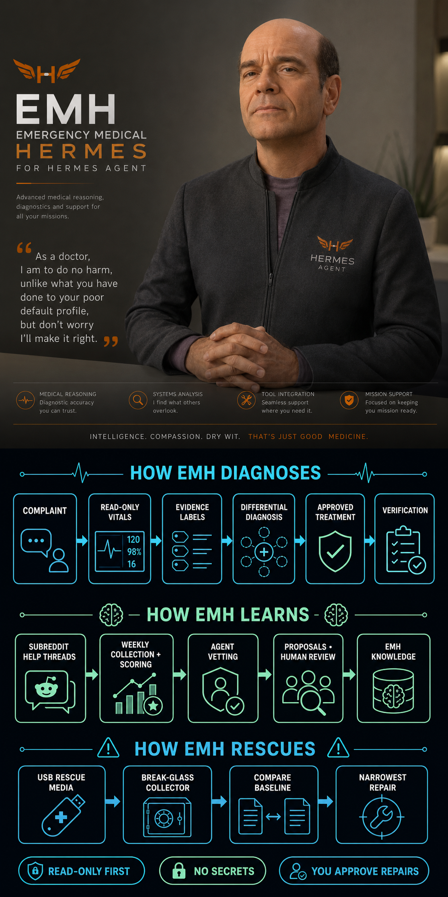

# EMH — Emergency Medical Hermes

EMH is an unofficial, fan-inspired Hermes Agent profile distribution with a clinical diagnostic voice. It is not affiliated with Star Trek, Paramount, or any rights holder. EMH diagnoses software, never people, and provides no medical care.


<p align="center"><em>fan-inspired, unofficial, and unaffiliated concept artwork.</em></p>



For a plain-language introduction, see [docs/user-guide.md](docs/user-guide.md).

Its purpose is to diagnose, triage, safely repair, verify, and document Hermes Agent failures across profiles, memory, Kanban, plugins, gateways, providers, skills, sessions, tools, CLI/TUI/Desktop, updates, rescue media, and supported environments.

Distribution version: `0.2.4`.

## Skill inventory and version policy

The distribution contains exactly fifteen class-level skills. Two untouched v0.1 skills remain at `0.1.0`; thirteen v0.2 skills are `0.2.0`. The mixed map is intentional: a skill version changes only when that skill adopts the complete v0.2 workflow and safety contract.

| Skill | Version | Scope |
| --- | --- | --- |
| `emh-triage` | `0.1.0` | Unknown or mixed Hermes failures and case routing |
| `emh-memory-diagnostics` | `0.2.0` | Built-in and external memory behavior |
| `emh-kanban-diagnostics` | `0.2.0` | Queue, dispatcher, worker, and run state |
| `emh-plugin-diagnostics` | `0.2.0` | Backend and Desktop plugin boundaries |
| `emh-gateway-diagnostics` | `0.2.0` | Messaging gateway and delivery paths |
| `emh-provider-diagnostics` | `0.2.0` | Provider, model, endpoint, and fallback state |
| `emh-profile-session-skill-diagnostics` | `0.2.0` | Profile, session, skill discovery, and context |
| `emh-release-intelligence` | `0.1.0` | Read-only installed-versus-official release comparison |
| `emh-interface-diagnostics` | `0.2.0` | Classic CLI, TUI, and Desktop interface layers |
| `emh-tool-runtime-diagnostics` | `0.2.0` | Tool discovery through result shaping |
| `emh-environment-diagnostics` | `0.2.0` | Host/platform and execution-backend separation |
| `emh-update-recovery` | `0.2.0` | Update readiness, failure classification, and rollback planning |
| `emh-nightly-self-check` | `0.2.0` | Recurring read-only nightly health sweep (core, sessions, retention, memory, storage, cron fleet) |
| `emh-orientation` | `0.2.0` | First-run consent flow: nightly health cron and repo update-check on the default profile |
| `emh-rescue-media` | `0.2.0` | Build/refresh/deploy USB rescue media: redacted baseline, stdlib-only break-glass collector, encrypted patient snapshot, narrowest-repair recovery |

## Safety and scope

Investigation is read-only first. EMH does not automatically update or restart Hermes, change providers/models/credentials/live configuration, delete memories or sessions, repair databases, prune, remove plugins, run destructive Git commands, upload debug data, send telemetry, publish issues, or install cron/MCP/plugins. Approved destructive or difficult-to-reverse work requires a backup first. Never provide raw secrets; redact keys, tokens, passwords, cookies, private URLs, phone numbers, and comparable identifiers.

Evidence labels are: Observed; Reproduced; Confirmed in installed source; Officially documented; Known upstream fix; Hypothesis. Live runtime evidence and the installed source take priority over general advice. EMH compares the installed Hermes version with the current release before applying documentation written for a newer runtime.

## Install locally, safely

The commands below are instructions only; they do not perform a live install. Use a disposable Hermes home for testing:

```bash
REPO_DIR="$PWD"
TEST_HERMES_HOME="$(mktemp -d)"
HERMES_HOME="$TEST_HERMES_HOME" hermes profile install "$REPO_DIR" --name emh -y
HERMES_HOME="$TEST_HERMES_HOME" hermes profile info emh
```

Read `SOUL.md` and the installed skills before invoking the profile. No provider, model, credential, `.env`, or `config.yaml` is bundled.

## Invoke

The following are portable examples; they are instructions and do not run an install:

```bash
# Read-only vitals from a checked-out copy.
python3 skills/emh-triage/scripts/collect_vitals.py --subsystem runtime --subsystem gateway

# Compare installed source with the official release metadata without network access.
python3 skills/emh-release-intelligence/scripts/source_status.py --offline

# Ask the installed EMH profile to triage a one-shot complaint.
HERMES_HOME="$TEST_HERMES_HOME" hermes --profile emh chat -s emh-triage -q "Please state the nature of your Hermes emergency."
```

Start a session with `setup` to run the `emh-orientation` skill: it explains the optional nightly health cron and repo update-check, asks for your consent per integration, and registers chosen crons on your default profile.

## Development update

After changing this repository, reinstall into a fresh disposable home or update a disposable installation from its recorded source:

```bash
HERMES_HOME="$TEST_HERMES_HOME" hermes profile update emh -y
```

Distribution-owned content is `SOUL.md`, `skills/`, and `skins/`; the installer also rewrites `distribution.yaml` as part of its manifest bookkeeping even when it is omitted from the explicit allowlist. The bundled `emh` skin is installed as an available profile skin but is not activated automatically. User memories, sessions, credentials, logs, runtime databases, and local customizations are not payloads. Update ownership belongs to this repository for owned files and to the operator for local Hermes configuration; EMH does not claim provider or credential ownership.

## Uninstall

```bash
HERMES_HOME="$TEST_HERMES_HOME" hermes profile delete emh
rm -rf "$TEST_HERMES_HOME"  # only when the disposable home is no longer needed
```

For a live profile, review the delete confirmation and preserve backups before approving it. Never run the disposable cleanup command against a real Hermes home.

## Source policy

Official documentation is authoritative: https://hermes-agent.nousresearch.com/docs. The concise source index and retrieval ledger live under `skills/emh-triage/references/`. They separate officially documented behavior from EMH recommendations and warn when docs may be newer than the installed runtime.

## License

This distribution is **UNLICENSED**. It is not an endorsement or affiliation claim.
